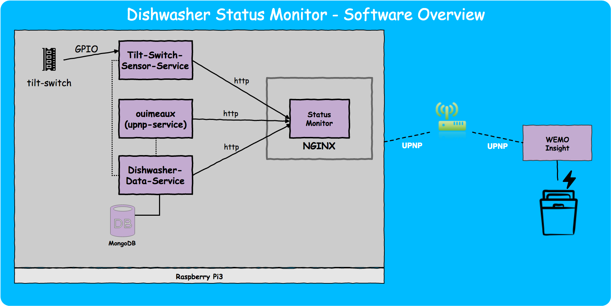

## Dishwasher Statuspage @Jambit

### Motivation
I'm working at a midsized company with a community kitchen and a single dishwasher. Our dishwasher's user interface is not visible once the door is closed, hence there is no status information available, when it is on duty or not. Accordingly when a wash cycle is finished, nobody will know, that it is finished, hence nobody will empty the dishwasher. Another annoying example is when my colleagues want to behave like their mother tought them and they put the dirty plates in the dishwasher while it is running. Meant well, but it's not working.

As a consequence nobody wants to open the dishwasher when the door is closed and the plates and mugs are just added on another on the kitchen tray. At around 4 o'clock in the afternoon you will lose every interest in a nice cappucino when this mess welcomes you. 

As a first attempt our team assistances printed signs with "running" and "not running" which was a good idea, but the status was hardly in sync to the real status, since you had to flip them manually. 

The idea was pretty clear how to solve this issue: "We need to meassure the energy consumption and then we can decide, if it's running or not and show the current status on a display." me and my colleagus said. Thats easier sad than done, but in the end I found a pretty neat solution.  

### Architecture

## Contribute and participate

I'd be very happy, if you like to support my project. If you have any ideas just contact me in person or submit an issue. 
