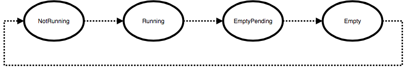
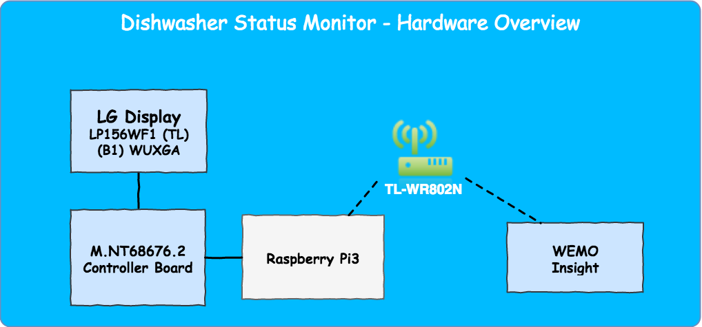

## Dishwasher Statuspage @Jambit

### Motivation
I'm working at a midsized company with a community kitchen and a single dishwasher. Our dishwasher's user interface is
not visible once the door is closed, hence there is no status information available, when it is on duty or not. 
Accordingly when a wash cycle is finished, nobody will know, that it is finished, hence nobody will empty the 
dishwasher. Another annoying example is when my colleagues want to behave like their mother tought them and they put the
dirty plates in the dishwasher while it is running. Meant well, but it's not working.

As a consequence nobody wants to open the dishwasher when the door is closed and the plates and mugs are just added on 
another on the kitchen tray. At around 4 o'clock in the afternoon you will lose every interest in a nice cappucino when 
this mess welcomes you. 

As a first attempt our team assistances printed signs with "running" and "not running" which was a good idea, but the 
status was hardly in sync to the real status, since you had to flip them manually. 

The idea was pretty clear how to solve this issue: "We need to meassure the energy consumption and then we can decide, 
if it's running or not and show the current status on a display." me and my colleagues said. That's easier sad than done,
but in the end I found a pretty neat solution.  

### How does it work?
[Wemo Switch Insight](http://www.belkin.com/de/p/P-F7C029/) offers a rich set of information which is exposed via its 
own mobile app - which is not that helpful in this case - and via its open 
[API](http://ouimeaux.readthedocs.io/en/latest/). The raw data can be accessed via UPnP only, hence a special service is 
needed which maps the exposed data to something more common, like a JSON-File.
[Ouimeaux](https://github.com/waspmuc/ouimeaux) offers exactly this functionality by providing a Python rest-server
which returns the current state of the switch with every GET-request. A possible JSON-response looks like the following:
  
  ```
              "wemodishwasher": {
                  "currentpower": 1195,
                  "host": "192.168.40.55",
                  "lastchange": "2017-01-08 18:18:29",
                  "model": "Belkin Insight 1.0",
                  "name": "wemodishwasher",
                  "onfor": 0,
                  "ontoday": 13119,
                  "ontotal": 12810,
                  "serialnumber": "221613K12000CB",
                  "state": 8,
                  "todaymw": 0.577718811554376,
                  "totalmw": 34663128,
                  "type": "Insight",
                  "createdAt": "2017-01-08T17:20:13.003Z"
              }
  ```
  
This information is used by the frontend to trigger the 
[state-machine](https://github.com/jakesgordon/javascript-state-machine) which shows the related images e.g.
"running" or "not running". 



Once the monitor detects that a run is finished, it transits to `emptyPending` and shows the sign "Please empty!". When
someone opens the door to empty the fresh and clean plates the
 [tiltswitch-sensor-service](https://github.com/waspmuc/tiltswitch-sensor-service)
will deliver the current state of it's tiltswitch sensor. The sensor response is `true`, when the door is completely 
opened. After 15 seconds the monitor assumed the dishwasher is empty and ready for a new run and transits to its state 
`cleaned` and finally back to `not runnning`.  

### Architecture




### Future work
To investigate typical patterns of power consumption in order to configure the thresholds for the statemachine I 
implemented a [data-service](https://github.com/waspmuc/dischwascher-data-service)
which sends request to ouimeaux and stores it's responses in MongoDB. After that I visualized the data with 
[chartist](https://gionkunz.github.io/chartist-js/). It could be interesting to store multiple runs with the existing 
different programs the dishwasher is offering and show live data/movement on the chart itself. 

## Contribute and participate

I'd be very happy, if you like to support my project. If you have any ideas or found a bug just contact me in person 
or submit an issue. 
